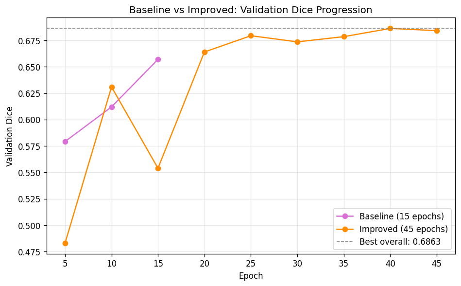
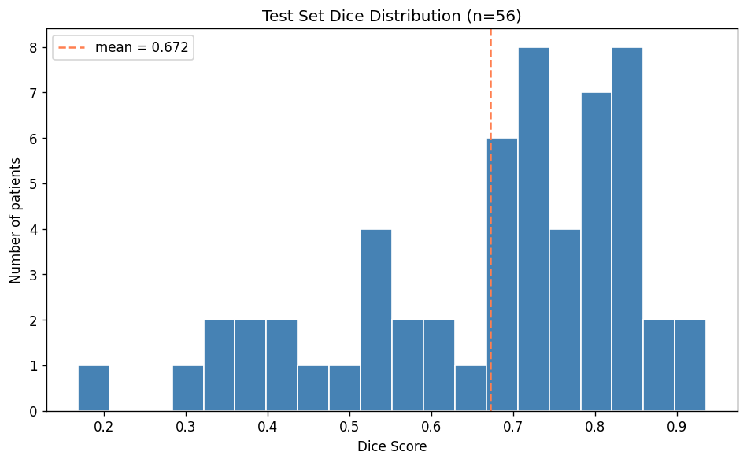
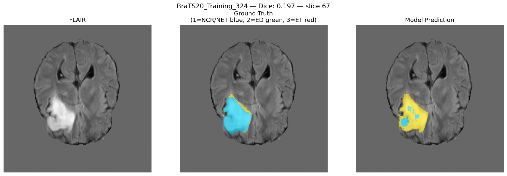
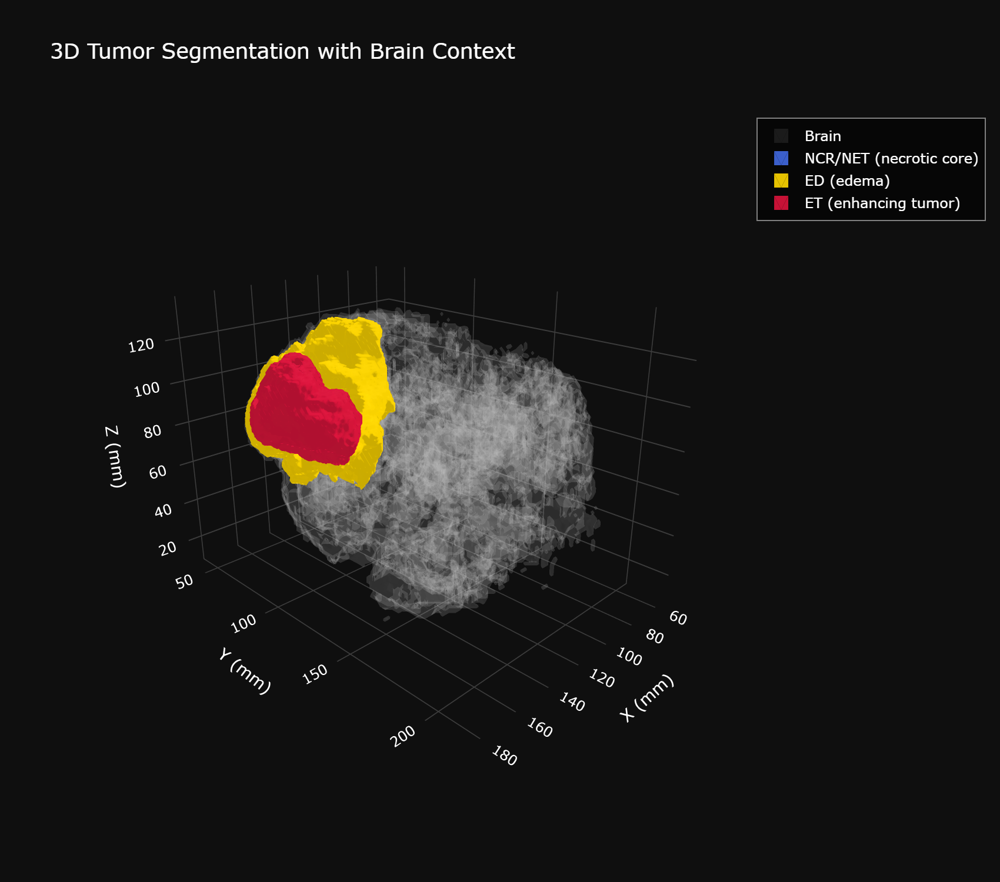
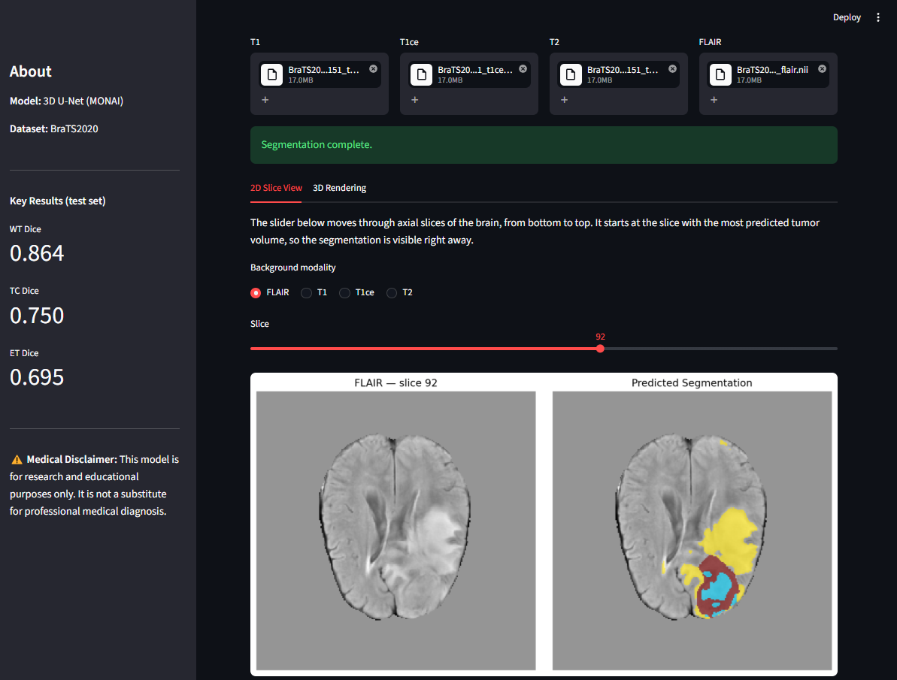
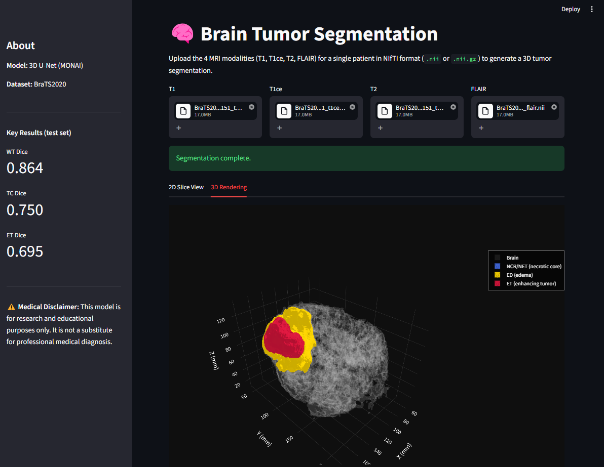
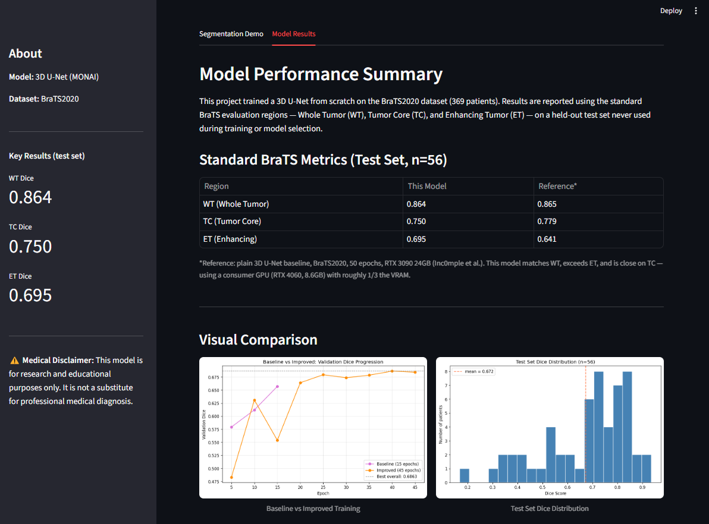

# 🧠 Brain Tumor Segmentation — 3D U-Net on Multi-Modal MRI

Deep learning system for volumetric segmentation of brain tumors from multi-modal MRI (BraTS2020), built with a 3D U-Net (MONAI). The project follows a full engineering cycle — baseline, error analysis, evidence-based improvement, and final evaluation on a held-out test set.

---

## 🎯 Project Overview

This project tackles 3D brain tumor segmentation on the BraTS2020 dataset, predicting three tumor sub-regions (necrotic core, edema, enhancing tumor) directly from 3D MRI volumes across 4 modalities (T1, T1ce, T2, FLAIR).

**Approach:** A systematic engineering process — baseline training, per-class error analysis, and evidence-based extended training with a checkpoint/resume system — evaluated on a fully held-out test set never touched during training or model selection.

### Key Results (Test Set, n=56 patients)

| Metric | This Model | Reference Baseline* |
|--------|-----------|---------------------|
| **WT (Whole Tumor) Dice** | **0.864** | 0.865 |
| **TC (Tumor Core) Dice** | **0.750** | 0.779 |
| **ET (Enhancing Tumor) Dice** | **0.695** | 0.641 |

> **Resource-constrained result:** This model matches WT, exceeds ET, and is close on TC — trained on a consumer GPU (RTX 4060, 8.6GB VRAM), roughly 1/3 the VRAM of the reference setup.
>
> *Reference: plain 3D U-Net baseline, BraTS2020, 50 epochs, RTX 3090 24GB (Inc0mple et al., [github.com/Inc0mple/3D_Brain_Tumor_Seg_V2](https://github.com/Inc0mple/3D_Brain_Tumor_Seg_V2))

---

## 📁 Dataset

| Dataset | Patients | Role | Source |
|---------|----------|------|--------|
| **BraTS2020** | 369 | Train (258) / Val (55) / Test (56) | [Kaggle](https://www.kaggle.com/datasets/awsaf49/brats20-dataset-training-validation) |

Each patient has 4 MRI modalities (T1, T1ce, T2, FLAIR) in NIfTI format, plus expert segmentation labels: necrotic/non-enhancing tumor core (NCR/NET), peritumoral edema (ED), and GD-enhancing tumor (ET). Split performed at the patient level (not per-slice) to avoid data leakage.

> **Data quality note:** One training patient had a non-standard mask filename (differing from the `_seg.nii` convention) and was corrected manually before training.

---

## 🧠 Model Architecture & Training

### Base Model
- **Architecture:** 3D U-Net (MONAI), 4,811,129 parameters
- **Input:** 4-channel patches (96×96×96), fused from T1/T1ce/T2/FLAIR
- **Task:** Multi-class voxel-wise segmentation (background + 3 tumor sub-regions)

### Training Configuration
- **Loss:** DiceFocalLoss (0.5 × Dice + 0.5 × Focal) — chosen for severe class imbalance (tumor ≈1% of total volume)
- **Optimizer:** AdamW (lr=1e-4, weight_decay=1e-5)
- **Sampling:** Foreground-biased patch extraction (`RandCropByPosNegLabeld`) to counter class imbalance
- **Baseline run:** 15 epochs → Dice 0.657 (still rising)
- **Extended run:** 45 epochs with a full checkpoint/resume system (survived a real power/network outage mid-training) → Dice 0.686, plateauing around epoch 35-45

---

## 📊 Evaluation Results

### Model Comparison

| Stage | Validation Dice | Notes |
|-------|-----------------|-------|
| Baseline (15 epochs) | 0.657 | Still improving at final epoch |
| Extended training (45 epochs) | **0.686** | Plateaued; +2.9 points over baseline |

### Test Set Performance (never used in training or model selection)

| Metric | Value |
|--------|-------|
| Overall Dice (raw per-class average) | 0.672 |
| NCR/NET Dice | 0.592 (weakest class) |
| ED Dice | 0.712 |
| ET Dice | 0.695 |
| Validation → Test gap | −0.014 (small — indicates good generalization) |

### 📈 Visualizations

**Baseline vs Improved Training:**





**Test Set Dice Distribution:**





**Worst-Case Prediction (Class Confusion Analysis):**





**3D Tumor Rendering with Brain Context:**





An interactive, rotating version is available: [3D rendering (HTML)](./results/figures/3d_tumor_rendering.html) · [rotation GIF](./results/figures/3d_tumor_rotation.gif)

---

## 🔍 Engineering Journey

This project followed a systematic diagnose → hypothesize → test → verify cycle:

### 1. Baseline & Root Cause Analysis (Notebooks 03–04)
After 15 epochs, baseline Dice reached 0.657 with validation Dice still rising — suggesting the model was undertrained rather than saturated. Per-class error analysis on the validation set revealed:
- **NCR/NET was the weakest class** (mean Dice 0.513), well below ED (0.707) and ET (0.689)
- **Tumor size was not the driver of poor performance** (correlation with Dice: r=0.177) — ruling out the simplest explanation
- Visual inspection of the worst case showed the model **confusing NCR/NET with ET**, likely relying too heavily on FLAIR/T2 brightness rather than the T1ce contrast that best distinguishes necrotic tissue

### 2. Extended Training with Checkpoint/Resume (Notebook 04b)
Based on the evidence that the model was still learning, training was extended to 45 epochs. A full checkpoint/resume system (model + optimizer state + epoch + best Dice, saved every epoch) was implemented to make the ~21-hour run resilient to interruptions — it in fact survived a real power and network outage mid-run.

**Result:** Dice improved from 0.657 to 0.686, plateauing around epoch 35-45 — confirming the model reached its practical ceiling with this architecture, patch size, and learning rate.

### 3. Final Evaluation Against Literature (Notebook 05)
Standard BraTS evaluation regions (WT/TC/ET) were computed on the held-out test set and benchmarked against a published resource-constrained baseline (Inc0mple et al.). Despite using roughly 1/3 the GPU memory, this model matched or exceeded the reference on 2 of 3 regions.

---

## 🌐 Interactive Web Application

**Live Demo:** [Streamlit Cloud](https://brain-tumor-segmentation-3d-hlg9klbvsktmb3qyjdyzub.streamlit.app/)

### Screenshots

**2D Slice View (multi-modality toggle):**





**3D Rendering:**





**Model Results Tab:**





**Full Walkthrough:**


### Features
- Upload all 4 MRI modalities (T1, T1ce, T2, FLAIR) in NIfTI format → automatic 3D segmentation
- 2D slice viewer with switchable background modality (FLAIR/T1/T1ce/T2)
- Interactive 3D rendering (brain context + color-coded tumor sub-regions)
- Model performance summary with standard BraTS metrics and comparison charts

### Run Locally

```bash
# Clone repository
git clone https://github.com/foroughm423/brain-tumor-segmentation-3d.git
cd brain-tumor-segmentation-3d

# Install dependencies
pip install -r requirements.txt

# Run app
streamlit run app/streamlit_app.py
```

> **Note:** The trained model weights are hosted privately on Hugging Face Hub. The live demo above uses secure token authentication via Streamlit Secrets — no setup needed to use the demo. To run locally, create a `.env` file with `HF_TOKEN=your_token_here` (a read-only token is sufficient).

---

## 📂 Repository Structure

```
brain-tumor-segmentation-3d/
├── README.md
├── requirements.txt
├── .gitignore
├── LICENSE
│
├── app/
│   ├── streamlit_app.py            # Streamlit web application
│   └── assets/                     # Demo screenshots and GIF
│
├── notebooks/
│   ├── 01_data_exploration.ipynb
│   ├── 02_data_preparation.ipynb
│   ├── 03_baseline_training.ipynb
│   ├── 04_error_analysis.ipynb
│   ├── 04b_improvement.ipynb
│   └── 05_final_evaluation.ipynb
│
├── configs/
│   └── dataset_split.json
│
└── results/
    ├── figures/
    │   ├── sample_slices.png
    │   ├── modality_comparison.png
    │   ├── tumor_size_distribution.png
    │   ├── patch_samples.png
    │   ├── baseline_prediction_sample.png
    │   ├── worst_case_predictions.png
    │   ├── baseline_vs_improved_comparison.png
    │   ├── test_set_dice_distribution.png
    │   ├── 3d_tumor_rendering.png / .html
    │   └── 3d_tumor_rotation.gif
    └── metrics/
        ├── baseline_per_patient_dice.json
        └── final_test_dice.json
```

---

## 🛠️ Technologies

- **Python 3.10**
- **PyTorch 2.6** + CUDA 12.4 (training) / CPU (deployment)
- **MONAI 1.5.2** (3D U-Net, transforms, sliding window inference)
- **Weights & Biases** (experiment tracking)
- **Plotly + scikit-image** (3D volume rendering via marching cubes)
- **Streamlit** (web deployment)
- **Hugging Face Hub** (secure model hosting)

---

## 🚀 Future Improvements

- [ ] Train on the full BraTS2023 dataset (1,251 patients vs. 369 here)
- [ ] Address the NCR/NET vs. ET confusion identified in error analysis (e.g., modality-specific attention)
- [ ] Post-processing: remove small isolated false-positive components (largest connected component filtering)
- [ ] Experiment with larger patch sizes / SegResNet given more VRAM
- [ ] MedSAM-based refinement of segmentation boundaries

---

## 📖 References

1. [BraTS2020 Dataset](https://www.kaggle.com/datasets/awsaf49/brats20-dataset-training-validation) — Menze et al., Bakas et al.
2. [MONAI](https://monai.io/) — Medical Open Network for AI
3. Inc0mple et al., *3D Brain Tumor Segmentation* (SUTD) — [GitHub](https://github.com/Inc0mple/3D_Brain_Tumor_Seg_V2), resource-constrained reference baseline

---

## 🔗 Links

- **Live Demo:** [Streamlit Cloud](https://brain-tumor-segmentation-3d-hlg9klbvsktmb3qyjdyzub.streamlit.app/)
- **Source Code:** [GitHub](https://github.com/foroughm423/brain-tumor-segmentation-3d)
- **Model Weights:** [Hugging Face Hub](https://huggingface.co/foroughm423/brain-tumor-segmentation-3d-unet) *(private)*
- **Experiment Tracking:** [Weights & Biases Report](https://api.wandb.ai/links/foroughm423/19lhsvtj)
- **Training Notebooks (with outputs):**
  - [01 — Data Exploration](https://www.kaggle.com/code/foroughgh95/brain-tumor-01-data-exploration)
  - [02 — Data Preparation](https://www.kaggle.com/code/foroughgh95/brain-tumor-02-data-preparation)
  - [03 — Baseline Training](https://www.kaggle.com/code/foroughgh95/brain-tumor-03-baseline-training)
  - [04 — Error Analysis](https://www.kaggle.com/code/foroughgh95/brain-tumor-04-error-analysis)
  - [04b — Improvement](https://www.kaggle.com/code/foroughgh95/brain-tumor-04b-improvement)
  - [05 — Final Evaluation](https://www.kaggle.com/code/foroughgh95/brain-tumor-05-final-evaluation)

---

## ⚖️ License

This project is licensed under the MIT License. See [LICENSE](LICENSE) for details.

---

## 👩‍💻 Author

**Forough Ghayyem**
📫 [GitHub](https://github.com/foroughm423) | [LinkedIn](https://www.linkedin.com/in/forough-ghayyem/) | [Kaggle](https://www.kaggle.com/foroughgh95)

---

## 🙏 Acknowledgments

- BraTS2020 dataset: Multi-institutional MICCAI Brain Tumor Segmentation Challenge
- MONAI Consortium
- Model hosting: Hugging Face Hub

---

> ⚠️ **Medical Disclaimer:** This model is for research and educational purposes only. It should not be used as a substitute for professional medical diagnosis. Always consult a qualified radiologist or oncologist for proper evaluation of MRI findings.
